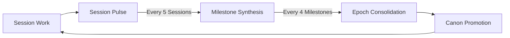

# Temporal Pulse — Proactive Knowledge Evolution

> Transforms reactive learning into systematic, activity-based [[knowledge]] synthesis.

## Overview

Unlike `self-evolve.md` which triggers on errors, Temporal Pulse runs on an **activity cadence** to proactively synthesize accumulated [[knowledge]] into structured insights. Because it is triggered by activity (sessions) rather than calendar dates (weeks/months), it remains effective even if a project is paused or touched infrequently.



---

## Session Pulse (End of Each Session)

**Trigger**: Automatically before `/session-offload` or manually via `/temporal-pulse session`

### Steps
1. **Scan session history**: Read `.orion/episodic/session_history.md`
2. **Extract key artifacts**:
   - Decisions made (look for "decided", "chose", "picked")
   - Errors encountered (exit code > 0 patterns)
   - New patterns discovered
3. **Generate session entry**:
   ```bash
   python .agents/scripts/orion.py consolidate session
   ```
   → Creates `.orion/episodic/sessions/session_YYYYMMDD_HHMMSS.md`
4. **Auto-Trigger Check**: If 5 unprocessed session pulses exist, the script automatically triggers a Milestone Synthesis.

### Session Entry Format
```markdown
# Session Pulse — YYYYMMDD_HHMMSS

## Decisions
- [Decision 1]: [Context + rationale]

## Errors Resolved
- [Error]: [Root cause] → [Fix applied]

## Patterns Observed
- [Pattern]: [Frequency] [Recommendation]
```

---

## Milestone Synthesis (Every 5 Sessions)

**Trigger**: Auto-triggered by the 5th Session Pulse, or manual via `/temporal-pulse milestone`

### Steps
1. **Read unprocessed session entries**: `.orion/episodic/sessions/session_*.md`
2. **Cross-reference with Orion Graph**: 
   - Which triplets were most frequently accessed? (`access_count DESC`)
   - Which nodes had contradiction resolutions?
3. **Pattern detection**:
   - Recurring errors → candidate for new rule in `.agents/rules/`
   - Recurring decisions → candidate for new standard
4. **Generate milestone synthesis**:
   ```bash
   python .agents/scripts/orion.py consolidate milestone
   ```
   → Creates `.orion/episodic/milestones/milestone_YYYYMMDD_HHMMSS.md`
5. **Archive**: Used session pulses are moved to `sessions/processed/`.

### Milestone Synthesis Format
```markdown
# Milestone Synthesis — YYYYMMDD_HHMMSS

## Top Patterns (confirmed ≥3x)
- [Pattern]: Promoted to LEARNINGS.md

## Knowledge Graph Hotspots
- Most accessed: [node] (N accesses)
- Most mutated: [node] (N modifications)

## Contradictions Resolved
- [Topic]: [Resolution summary]

## Recommended Actions
- [ ] Create rule for [recurring pattern]
- [ ] Automate [repetitive task]
```

---

## Epoch Consolidation (Every 4 Milestones)

**Trigger**: Auto-triggered by the 4th Milestone Synthesis, or manual via `/temporal-pulse epoch`

### Steps
1. **Compile unprocessed milestone syntheses** from `.orion/episodic/milestones/milestone_*.md`
2. **Identify emerging frameworks**: Themes that span multiple milestone reports
3. **Canon promotion check**:
   - Propose promotion to `.agents/canons/`
   - Elevate rules to `core-guardrails.md`
4. **Archive**: Used milestone syntheses are moved to `milestones/processed/`.
5. **Generate epoch report**:
   ```bash
   python .agents/scripts/orion.py consolidate epoch
   ```
   → Creates `.orion/episodic/epochs/epoch_YYYYMMDD_HHMMSS.md`

---

## Integration with Existing Workflows

| Event | Temporal Pulse Action |
|---|---|
| Session ends (`/session-offload`) | Auto-trigger Session Pulse |
| `self-evolve.md` extracts a pattern | Feed into next Session Pulse |
| 5th Session Pulse completes | Auto-trigger Milestone Synthesis |
| 4th Milestone Synthesis completes | Auto-trigger Epoch Consolidation |

## Anti-Patterns
- ❌ Don't trigger pulses via crontab — use activity hooks so paused projects aren't flooded with empty pulse files.
- ❌ Don't promote patterns to canons without multiple milestone confirmations.
